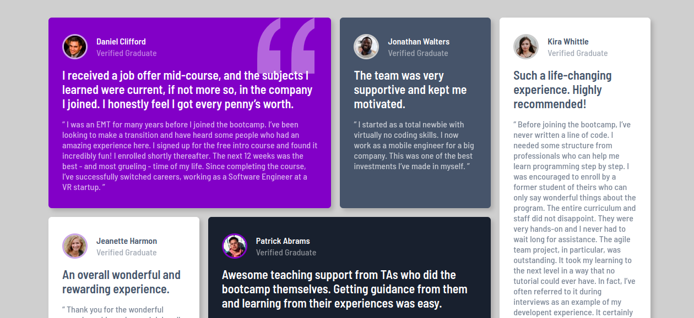

<h1>Testimonial Grid Solution</h1>

[Live](https://aakanshya-gahatraj.github.io/fm-challenges/testimonials-grid-section-main/) | [Solution](https://www.frontendmentor.io/solutions/responsive-testimonials-section-using-css-grid-xtOft1QcxC) | [Challenge](https://www.frontendmentor.io/challenges/testimonials-grid-section-Nnw6J7Un7)

## About
This is a beginners challenge which helps test out one's layout skill and responsive skills. The challenge is basically to create a testimonials page that matches closely to the given design.

## The challenge
Users should be able to:

- View the optimal layout for the component depending on their device's screen size

## Built With
- HTML
- CSS Flex and Grid
- Mobile-First Approach

## What I Learned

This challenge was fun and easy to complete. It helped me test out my CSS grid and responsive skills.

## My Next Challenge

Now I would like to try out making a landing page. Hence, my next challenge will be : [ Challenge to undertake](https://www.frontendmentor.io/challenges/sunnyside-agency-landing-page-7yVs3B6ef)

